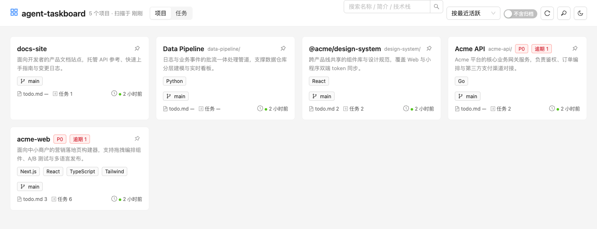
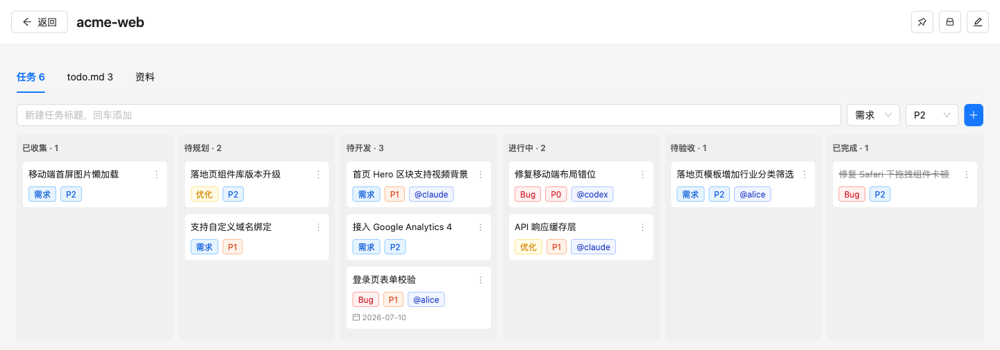
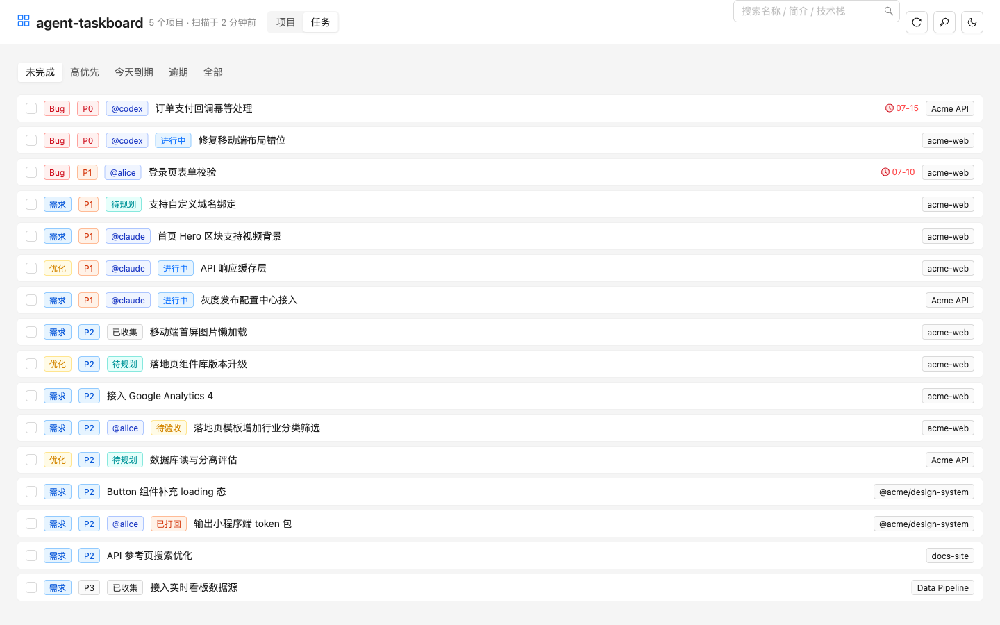

# agent-taskboard

[](https://github.com/52216108/agent-taskboard/actions/workflows/ci.yml)
[](LICENSE)

[English](README.md) · 简体中文

### `board here`
**在任何项目目录里问一句：这儿有什么活？**

把本机所有项目的现状，和一个 coding agent 能直接领活的任务队列，接在一起。

它会扫描你机器上的项目目录，一屏看清每个项目在哪个分支、有没有未提交改动、用什么技术栈、待办剩多少；
同时提供一个六列任务看板——而这些任务，你的 coding agent 可以用一条命令直接领走、干完回写状态。



## 这和又一个待办应用有什么不同

一般的看板要求 agent 知道「项目 ID」「任务 ID」才能操作。这个不用：

```bash
cd ~/projects/some-app
board here                      # 自动认出当前目录属于哪个项目，列出它的任务
board here doing 42 --as codex  # 领活并署名
# ...干活...
board here review 42            # 干完交回——按约定 agent 不自己关闭任务
```

agent 在项目目录里工作，`board here` 按 **cwd** 认项目——不需要配置、不需要记 ID。
这条命令就是人和 agent 之间的交接口。

## 为什么用看板，而不是让 agent 自己列计划

agent 给自己列的计划活在上下文窗口里，而上下文是会丢失的：会话变长它被摘要稀释，会话结束它就没了。
外部看板不会。

- **状态扛得住上下文压缩**：`board here` 每次调用都重新读取完整现状。agent 不需要"记得"自己在做什么——它去问。
- **状态跨会话存活**：昨天是「进行中」的任务，今天还是「进行中」，连认领人一起。
- **打回形成闭环**：`board reject <id> "原因"` 只能对「待验收」的任务发起，原因会回灌进 agent 下次
  领这条任务时读到的 `board here` 输出里——你不用重新解释一遍。
- **一任务一 commit**：任务边界即提交边界，review 和回滚都能按任务粒度做。

**要分清哪些是强制的、哪些不是**：API 会校验状态值合法性、限定只有「待验收」的任务能被打回；置「已完成」
也不再走通用 `PATCH`（会被拒绝），只能经专门的 `POST /api/tasks/:id/accept`，并记录 `accepted_at`/`accepted_by`——
让"置完成"成为显式、可审计的动作，避免一次顺手的状态改动悄悄关掉任务。但这是**护栏，不是锁**：单用户工具里
人和 agent 共用一个 token，技术上并不能阻止 agent 自己去调 `accept`。「agent 只领待开发、干完置待验收而不是
直接置已完成」仍是写在 `AGENTS.md` 和 Claude Code skill 里的**工作流约定**。

## 功能

**项目扫描**（只读，实时）
- git 分支、未提交改动数、最近提交时间
- 技术栈识别、README 摘要、`tasks/todo.md` 解析
- 嵌套 git 仓库归并（外壳目录 + 内层仓库的项目结构）

**任务看板**
- 六列流转：已收集 → 待规划 → 待开发 → 进行中 → 待验收 → 已完成
- 优先级 / 类型（需求·缺陷·优化）/ 认领人 / 截止日期 / 图片附件
- 验收打回：待验收打回待开发时带原因，原因会回灌进 `board here` 输出给 agent 看
- 跨项目全局任务视图



所有项目的任务汇成一张表：



**远程访问**（可选）
- Bearer token 鉴权 + Tailscale 隧道

## 它撑得起什么工作方式

**两个 agent，一块板。** 不同 agent 领不同的活——`board here doing 42 --as codex` 会让卡片挂上
`@codex`，下一张可能是 `@claude`。谁干的活事后一目了然，这在你没盯着全程、事后才验收时是刚需。
看板不绑定任何厂商，所以混着用没有额外成本。

**异步验收。** agent 干完把任务置「待验收」——按约定它不自己关闭。你什么时候方便什么时候扫一遍看板，
不满意的直接打回：

```bash
board reject 42 "空输入的分支没有测试"
```

任务带着这句原因退回「待开发」，下一轮领它的 agent 会在 `board here` 输出顶部看到黄字的这句话，
排在任务描述前面。你不用在对话里把同一条意见再讲一遍，验收也不必卡在 agent 干等的那一刻。

**一个不必当场分诊的收件箱。** 六列里有两列位于「agent 能碰到的范围」之上游，这是刻意的：

| 列 | 含义 | 谁来动 |
|---|---|---|
| `collected` 已收集 | 收下了，还没判断 | 暂时没人——这是收件箱 |
| `backlog` 待规划 | 已决定要做，还没排期 | 你，在做规划时 |
| `todo` 待开发 | 分诊完成、可直接动手 | agent 从这里领活 |

它的意义是**把「记下来」的时刻和「做决定」的时刻分开**。凌晨一点冒出来的想法直接扔进去——
`board here add "..."` 默认就落 `collected`——不用当场排优先级、也不用论证它值不值得做。
攒着，等你状态合适的时候批量分诊。

有 agent 参与时这点更要紧。agent 干活途中撞见范围外的问题，可以顺手登记，
而不必二选一：要么擅自扩大改动范围，要么让这个发现消失。而且因为新条目落在 `collected` 而不是 `todo`，
**agent 无法给自己创造下一个任务**——它领活的那个队列里，永远只有你放进去的东西。

**看板不做的事**：它不分配工作、不启动 agent、不判断结果好坏。它只记录谁拿着什么、进行到哪一步、
以及某件事为什么被退回来。编排仍然发生在你原本做编排的地方——你自己的提示词、一个 CI 任务，
或者你在用的任何 agent 运行器。

## 快速开始

需要 Node 22+ 和 git。

### 让你的 coding agent 装

这是给「用 coding agent 干活的人」做的工具，所以最快的安装方式就是把这活交给你的 agent。
把下面这段粘给 Claude Code、Codex 或你在用的任何 agent：

```text
在这台机器上装好 agent-taskboard（https://github.com/52216108/agent-taskboard）。

1. clone 到合适的位置。构建前端：cd client && npm install && npm run build
   再装后端依赖：cd ../server && npm install
2. 问我项目都放在哪些目录（默认 ~/projects），据此设 BOARD_ROOTS 启动服务。
   确认 http://127.0.0.1:7788 能打开，并且它列出的项目确实是我的。
3. 把 bin/board 软链进我的 PATH，然后验证 `board ls` 可用、在我某个项目目录里跑
   `board here` 能正确认出那个项目。
4. 把你自己接进来，这样你才能从看板领活：
   - Claude Code：把 docs/agents/board-tasks-skill.md 装到 ~/.claude/skills/board-tasks/SKILL.md
   - Codex：仓库根的 AGENTS.md 已经写好了，读一遍并确认你理解这套流转
     （只领「待开发」、干完置「待验收」、一任务一 commit）
5. macOS 上问我要不要开机自启。要的话：bash deploy/setup.sh
   （我有扫描根之外的项目就带上 BOARD_PROJECTS=...）

约束：服务保持绑定 127.0.0.1。除非我明确要求，不要把它暴露到网络；
若我要求，必须同时设置 BOARD_TOKEN。
```

第 4 步是最值得交给 agent 做的：它是人最容易忘的一步，也正是这一步让看板
从「你看的列表」变成「你的 agent 主动领活的队列」。

### 或者手动装

```bash
git clone https://github.com/52216108/agent-taskboard.git
cd agent-taskboard

# 构建前端（后端会托管它）
cd client && npm install && npm run build

# 启动后端
cd ../server && npm install && npm run start
```

打开 http://127.0.0.1:7788 。默认扫描 `~/projects` 下的目录。

安装 CLI（可选，但 agent 协作靠它）：

```bash
cd /path/to/agent-taskboard                  # 回到仓库根——上一段结束时你在 server/ 里
ln -sf "$PWD/bin/board" ~/.local/bin/board   # 确保该目录在 PATH 里
board help
```

macOS 用户可以用 `bash deploy/setup.sh` 一步装成开机自启服务（launchd），详见 [deploy/README.md](deploy/README.md)。

## CLI

```
board                       列出项目
board <项目>                查看某项目的任务（--json 输出结构化原文）
board here                  看「当前目录所属项目」的任务
board here add <标题>       给当前项目登记任务（--bug / --optimize 指定类型）
board here doing <id> --as <名字>   领活并署名
board here review <id>      干完交回验收
board [here] reject <id> "原因"     验收打回，原因回灌给 agent
board backup                备份数据库
```

## 接入你的 coding agent

教会你的 agent 这套工作流一次，它就能自己从看板领活：

- **Codex** —— 仓库根的 [AGENTS.md](AGENTS.md) 就是给它的规则文件，Codex 每次会话自动读取。
- **Claude Code** —— 把 [docs/agents/board-tasks-skill.md](docs/agents/board-tasks-skill.md) 装成 skill，或把其中约定并入你的 `CLAUDE.md`。
- **其他任何 agent** —— 把上面任一文件指给它即可，那就是同一套约定的纯 markdown 描述。

### 为什么任何 agent 都能用

看板不启动任何 agent，也不调用任何模型 API。agent 是主动方：它跑 `board here`（或直接调 HTTP API）
看有什么活、领走、干完回写状态。

这把通常的集成问题反了过来——没有适配层、没有参数模板、没有各家不同的权限标志要调对，
自然也没有兼容性矩阵要维护。唯一的要求是你的 agent **能执行 shell 命令**。
Claude Code、Codex、Gemini CLI、Qwen Code、Aider，或者你自己写的东西，一视同仁，
背后是哪家模型都无所谓。甚至不必是 AI：一个 shell 脚本或 CI 任务同样能驱动这套 CLI。

每个 agent 真正需要知道的是那套约定——只领「待开发」、干完置「待验收」、一任务一 commit。
这正是上面两个文件承载的内容。

### 任务流是怎么启动的

是拉取，不是推送——而且那次拉取由**你**触发。看板没有 webhook、不保持任何长连接，
agent 也不轮询它。流程从你让 agent 去看板干活开始，它调一次 `board here`，然后自己往下走。

这是 agent 的存在形态决定的：一次会话就是一个会结束的进程，没有常驻的东西可以被推送。
agent 也不会自行认领——skill 和 `AGENTS.md` 都写明要等你发起——因为任务状态是共享的，
agent 擅自领活会和你的分诊打架。

不过有一件事的行为很像推送：**打回原因不会丢在聊天记录里**。它挂在任务上，
下一个领这条活的 agent 会在 `board here` 输出顶部读到它。送达是有保证的，
只不过送达的时刻是 agent 来取的那一刻，而不是你写下它的那一刻。

想让任务流自动启动也可以，但要从外面套——一个 cron 或 CI 步骤定时轮询 `board here --json`，
有货就拉起 agent。`--json` 输出正是为此存在。看板不掺和这一层。

## 配置

后端环境变量：

| 变量 | 默认 | 说明 |
|---|---|---|
| `BOARD_ROOTS` | `~/projects` | 扫描根目录，逗号分隔可多个 |
| `BOARD_PROJECTS` | 空 | 扫描根之外额外纳入的项目路径，逗号分隔 |
| `BOARD_PORT` | `7788` | 监听端口 |
| `BOARD_HOST` | `127.0.0.1` | 绑定地址（见下方安全说明）|
| `BOARD_DB` | `~/.project-board/board.db` | SQLite 数据库路径 |
| `BOARD_TOKEN` | 空 | Bearer 访问令牌；绑定到网络地址时**必须**设置 |
| `BOARD_ALLOWED_HOSTS` | 空 | 额外允许的 `Host` 值，逗号分隔。**经反代/隧道访问时必须设**——否则反 DNS rebinding 校验会返回 `403 bad host` |
| `BOARD_SCAN_TTL` | `60000` | 扫描结果缓存毫秒数 |
| `BOARD_GIT_TIMEOUT` | `5000` | 单仓库 git 操作超时 |
| `BOARD_CONCURRENCY` | `6` | 扫描并发上限 |
| `BOARD_TASK_IMAGES_DIR` | `~/.project-board/task-images` | 任务附图存储目录。CLI 按同一路径读图，**覆盖时两边必须一致** |

CLI 环境变量：`BOARD_URL`（默认 `http://127.0.0.1:7788`）、`BOARD_TOKEN`、`BOARD_ACTOR`（认领署名默认值）。

## ⚠️ 安全

服务本身不替你执行任何东西。但**它存的任务会变成 coding agent 据以行动的指令**，
所以对看板的写权限，价值约等于 shell 权限。防护是按这个量级做的：

- 服务默认只绑 `127.0.0.1`，仅本机可达。
- **绑定到任何网络可达地址（含 `0.0.0.0`）时必须设置 `BOARD_TOKEN`，否则服务拒绝启动。** 这是硬性检查，不是警告。
- **即使只绑 loopback，浏览器照样够得着**。所有 `/api/` 请求都会校验 `Host` 白名单（挡 DNS rebinding）
  并拒绝浏览器发起的跨站请求。没有这道防线，你访问的任意网页都能改写你的任务——`text/plain` 的 POST
  属于 CORS simple request，根本不触发预检。经反代/隧道访问时，把域名加进 `BOARD_ALLOWED_HOSTS`。
- 即便设了令牌，也**不要把它直接暴露到公网**。要远程访问，请用 Tailscale 或 SSH 隧道——服务本身仍只绑 loopback，隧道负责加密和身份。
- 令牌校验：写操作只认 `Authorization: Bearer` 头（保留 CSRF 防护）；读操作额外允许 `?token=` 查询参数
  （`` 无法设自定义头）。比较是常量时间的，令牌在 access log 里会被脱敏。

完整威胁模型见 [SECURITY.md](SECURITY.md)。

数据库、日志、任务附图都在 `~/.project-board/` 下，不进版本库。

## 平台支持

- **macOS** —— 主要开发和使用平台，`deploy/` 下的 launchd 自启脚本仅适用于 macOS。
- **Linux** —— 核心功能（扫描 / 看板 / CLI）应该可用，但未经充分测试；开机自启需自行写 systemd unit。
- **Windows** —— 未测试。

唯一的原生依赖是 `better-sqlite3`，主流平台有预编译二进制，通常不需要本地编译。

## 开发

```bash
cd server && npm run dev    # 后端热重载（tsx watch）
cd client && npm run dev    # 前端 dev server，/api 代理到后端

cd server && npm run typecheck && npm test
```

代码结构见 [DIRECTORY.md](DIRECTORY.md)，数据表见 [SCHEMA.md](SCHEMA.md)，接口见 [API.md](API.md)。

## License

[MIT](LICENSE)
